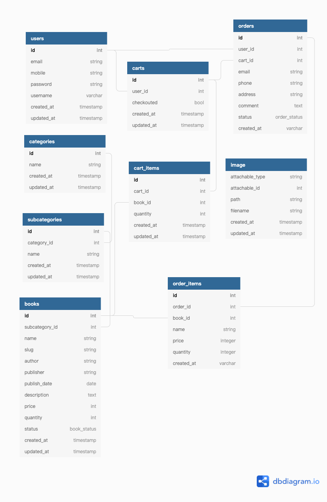

# LARAVEL API PRACTICE

Laravel框架的API練習，寫一個書店購物網站的API，用postman打api的形式，並沒有view。

## Requirements

- [Composer](https://getcomposer.org)
- php 7
- MySQL
- [基本的Laravel 8 安裝](https://laravel.com/docs/8.x/installation)

## Install
clone到你的檔案夾後

安裝所有的套件
```bash
composer install
```
複製一份.env檔案並且編輯local devloperment的變數(DB,Root之類的資料)
```bash
cp .env.example .env
```
填入資料庫架構與資料
```bash
php artisan migrate --seed
```
啟動in-build server
```bash
php artisan serve
```
## 資料庫設計

